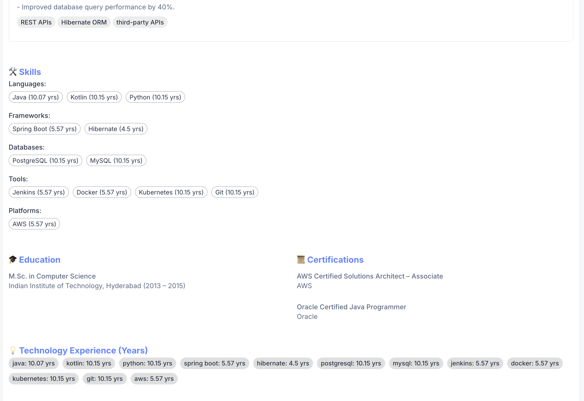

## This is complete end to end application which helps Talent acuisition team to hire right talent as per organization needs

## Features
1. Define job description and upload in human readable format. 
2. With uploaded job description , define rules for selection criteria
3. Upload profiles
4. Match profiles against multiple job descriptions
5. Get the score and details for every requirement as per job description
6. Role based access control for use by Organization or by recruiting agengcie.
7. Security integrated with firebase
8. Can work in SaaS mode or in individual tenant mode.

## Demo Screens

### Upload Resume

### Parsed Results

### Matched Score

[![Watch the demo]](https://youtu.be/u_Cl7UvRuSs)
